# Social Media Content Monitoring System

## Description

This project allows users to create and manage social media analysis projects. Users can input project details,
including the project name, personal API keys, and keywords for content search. The system then connects to Reddit,
Twitter, and YouTube APIs to collect data. The collected data is analyzed for sentiment, mentions, positive and negative
sentiment tracking, reach over time, and generates a word cloud visualization of popular words. Users can compare
projects, view social media statistics, and generate PDF reports. Content analysis is available for each data source.

## Features

- Project Creation
    - Users can create a project by providing a name, personal API keys, and content search keywords.
- Data Collection
    - The system connects to Reddit, Twitter, and YouTube APIs to collect relevant data for analysis.
- Text Analysis
    - Utilizes Stanford Core NLP dependency for sentiment analysis of text data.
- Statistical Analysis
    - Counts mentions, tracks positive and negative sentiment, and measures reach over time.
- Visualization
    - Generates a word cloud visualization of the most popular words in the collected data.
    - Utilizes Chart.js for creating charts and diagrams.
- Project Comparison
    - Users can compare multiple projects to analyze differences in social media statistics.
- Social Media Statistics
    - Displays total likes, retweet count, and other relevant statistics.
- PDF Report Generation
    - Generates a PDF report containing project statistics for easy sharing and documentation.
    - Utilizes flying-saucer for PDF report generation.
- Content Analysis
    - Provides detailed content analysis for each available source (Reddit, Twitter, YouTube).
- Registration and Authorization
    - Default registration and authorization features are implemented for user authentication.

## Technologies Used

- Java
- JavaScript
- Bootstrap
- Spring (Boot, Security, Data)
- lombok
- PostgreSQL
- FreeMarker (Template Engine)
- Chart.js
- Flying-saucer (for Report Generation)
- YT, Reddit, Twitter API

## Installation

1. Clone the repository.

```bash
git clone https://github.com/Spzabt-zz/Media_Content_Monitoring.git
```

2. Configure the application properties, including database settings.

```properties
spring.datasource.url=jdbc:postgresql://localhost:5432/socialmedia
spring.datasource.username=user
spring.datasource.password=password
```

3. Build and run the project.

###### For Linux/Mac:

```bash
./gradlew build
./gradlew bootRun
```

###### For Windows:

```powershell
.\gradlew build
.\gradlew bootRun
```

4. Generate own api keys for Reddit, Twitter and YouTube.
    - After user registration provide credentials in required fields, accessed by http://localhost:8080/credentials
      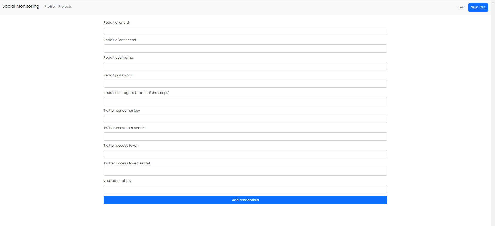
    - Reddit client id
    - Reddit client secret
    - Reddit username (account)
    - Reddit password (account)
    - Reddit's user agent (name of the script)
    - Twitter consumer key
    - Twitter consumer secret
    - Twitter access token
    - Twitter access token secret
    - YouTube api key

## Usage

1. Register and log in to the application.

2. Create a new project by providing a name, API keys, and keywords.
   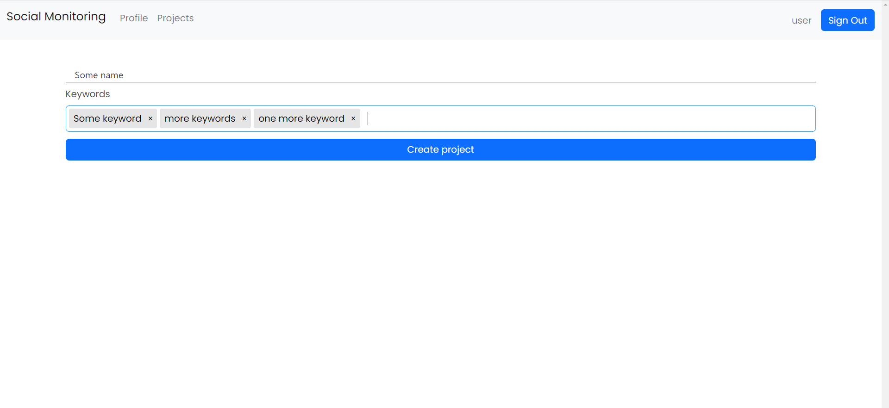
3. Explore and analyze social media data, generate reports, and compare projects.
   - Mentions page
     - 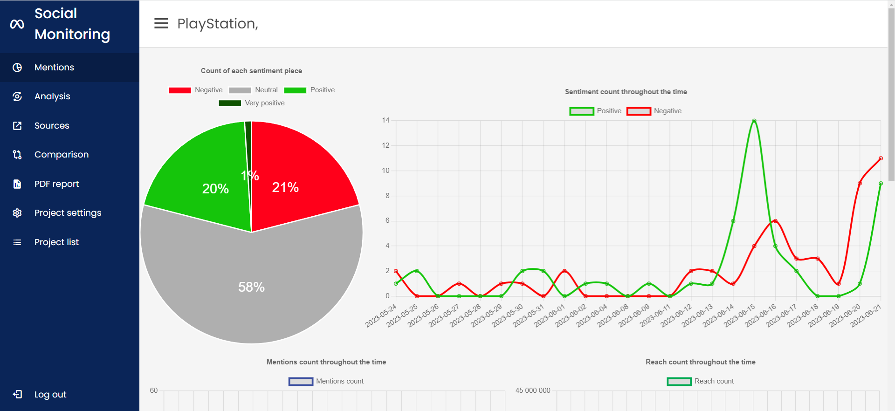
     - 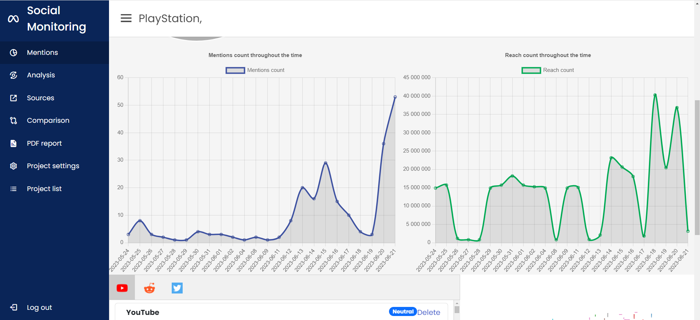
     - 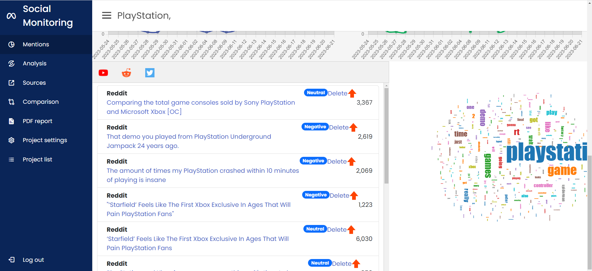
   - Analysis page
     - 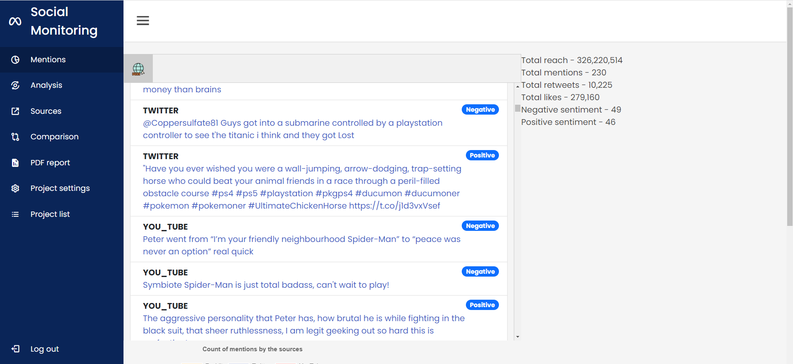
     - 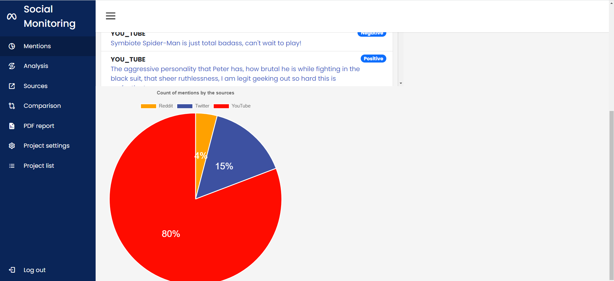
   - Sources page
     - 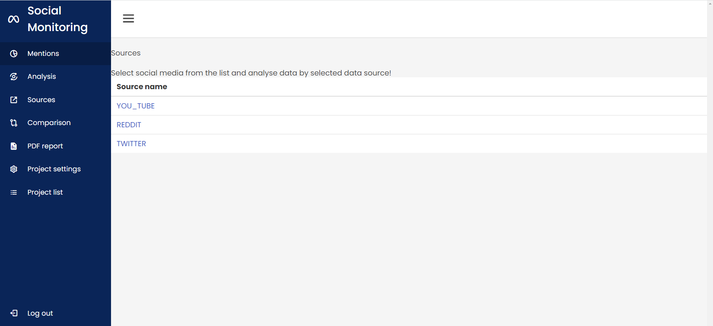
   - Comparison page
     - 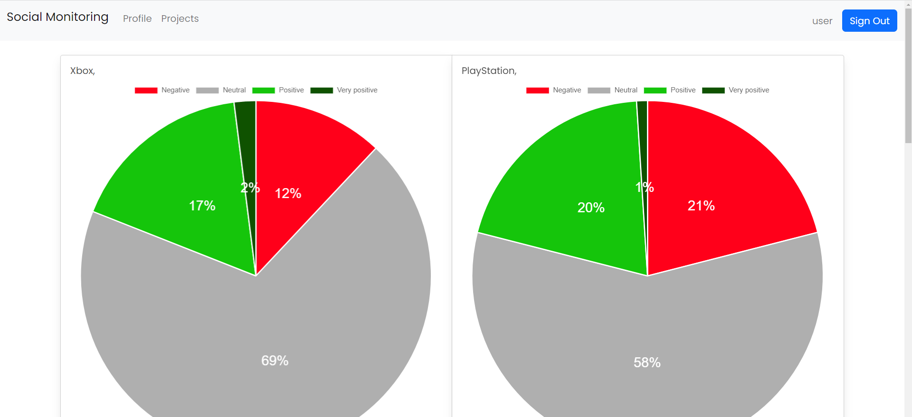
     - 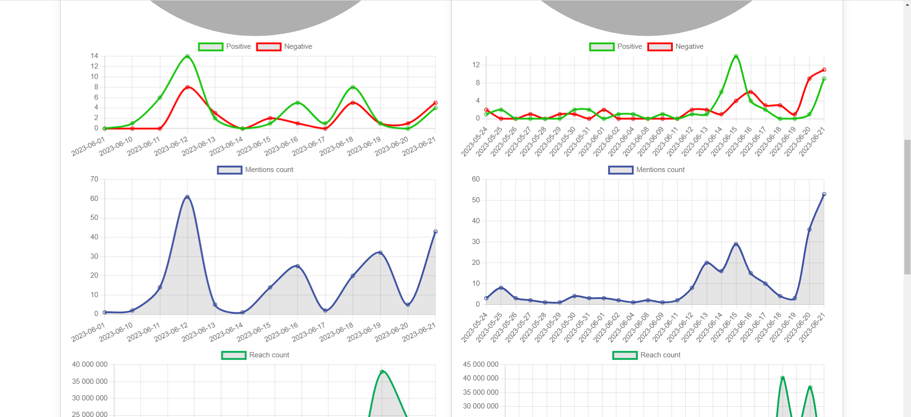
     - 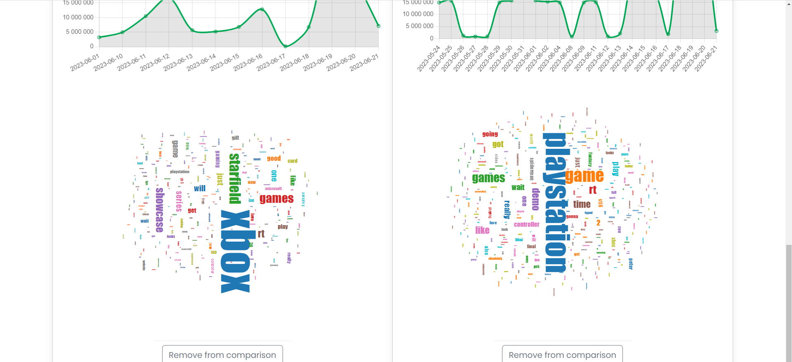
   - PDF report generation page
     - 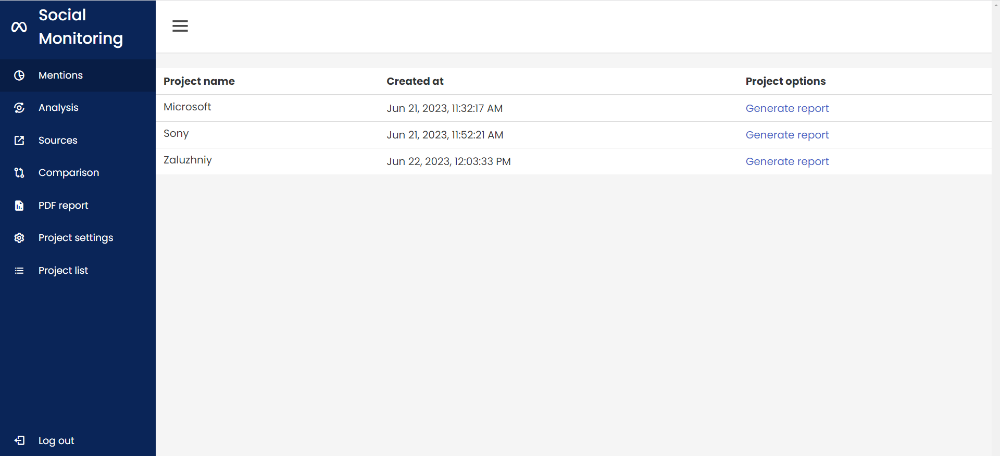

## Contributing

Feel free to contribute by opening issues or submitting pull requests.

## License
[](https://opensource.org/licenses/MIT)
#### This project is licensed under the MIT License